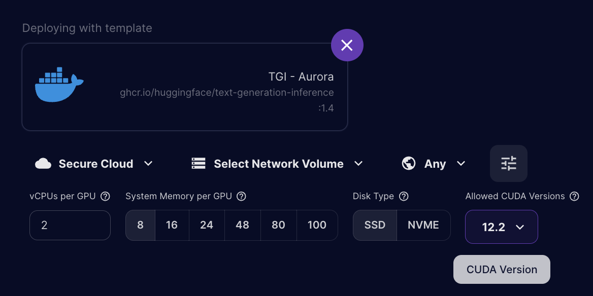

## Prerequisites
1. Create HuggingFace account
    - Accept T/C for [Aurora](https://huggingface.co/aurora-m/aurora-m-v0.1)

2. Add sshkey to runpod account/org (you need an administrator to do this)
    - Generate key with `ssh-keygen -t ed25519 -C "your_email@example.com"` and then look at `cat /Users/<you>/.ssh/id_ed25519.pub`
    - Paste this into Account -> Settings -> Public Keys

## Create and Connect to RunPod Instance
1. Spin up Axolotl Container
    -  Click [this link](https://runpod.io/gsc?template=v2ickqhz9s&ref=6i7fkpdz) and you will be taken to the runpod page where you will see “deploying with template axolotl-runpod”.
        - This link will point at the latest docker build of Axolotl. At the time of writing that is [this](https://hub.docker.com/layers/winglian/axolotl-cloud/main-py3.10-cu118-2.1.2/images/sha256-3a410a44e749b7a00e3c4033d33189b0b27280ae38d53c950bfe8e85cd6368d6?context=explore)
    - Select Organization from top right drop down
    - Scroll down to previous generation GPU section and click deploy on 1xA100 80GB. Later you can adjust this to be up to 8 and it will speed up training.
    - Leave all settings alone and click continue -> deploy
    - It will take a minute or two while it spins up the machine and the connect button becomes clickable

2. Connect to container over ssh
    - Click connect button and then this popup will show up. Click the TOP grey text to copy the "Basic SSH Terminal"
    -  Paste it into your terminal (on mac/linux) and run it. You will be dropped into a session with [TMUX running](https://www.redhat.com/sysadmin/introduction-tmux-linux). Tmux lets you resume the session if you get disconnected and do a bunch of other things, but also it makes things like scrolling weird so read that cheat sheet if you are unfamiliar
    - Note: If you forgot to add your public ssh key to the runpod org, you will get this error: `Permission Denied (publickey)`

## Setup Axolotl
1. Run the following commands
```bash
cd /workspace/
git clone https://github.com/Stillerman/axolotl-mdel
cd axolotl-mdel
huggingface-cli login # you will need to give it a read/write token from hf.co/settings/tokens
```

2. Download the lora-out folder if you don't still have it locally
```
git lfs install
git clone https://huggingface.co/stillerman/mtg-aurora
```

## Merge Model
1. `python3 -m axolotl.cli.merge_lora examples/aurora/lora.yml --lora_model_dir="./lora-out"`
    - This will download the weights (~5ish mins)
        - They are going to be cached in `/workspace/data/hf_home`
    - Then it will load in checkpoint shards (1ish mins)
    - Then it will merge

2. You will see `[2024-02-07 17:06:26,413] [INFO] [axolotl.scripts.do_merge_lora:88] [PID:757] [RANK:0] saving merged model to: lora-out/merged` once its completed

3. Here are the sizes of the directories for the LoRA and the merged
```
9.2G    ./mtg-aurora
30G     ./lora-out/merged
```

# Upload Merged Model to HuggingFace

```
huggingface-cli upload stillerman/aurora-mtg-merged ./lora-out/merged . --token=<READ/WRITE TOKEN HERE>
```

# Inference

1. Create template
- Go to template > new template in left hand menu
```
Container Image: ghcr.io/huggingface/text-generation-inference:1.4
Container Start Command: --model-id stillerman/aurora-mtg-merged
Container Disk: 100GB
Volume Disk: 100GB
Expose Ports: 80,8080

Add Env Variable

HUGGING_FACE_HUB_TOKEN: <PLACEHOLDER>
```

2. Spin up template on A100
    - **MAKE SURE YOU HAVE SELECTED CUDA 12.2 min version** 
    - Override HF_TOKEN with your read token

3. Post request

```
curl https://ikgih3vb97q78n-80.proxy.runpod.net/generate \
    -X POST \
    -d '{"inputs":"Name:","parameters":{"max_new_tokens":1024, "do_sample":true, "repetition_penalty":1.1, "top_p":0.95, "top_k":40, "temperature": 0.9, "stop":["###"], "return_full_text": true}}' \
    -H 'Content-Type: application/json'

```