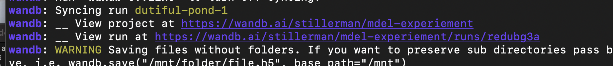
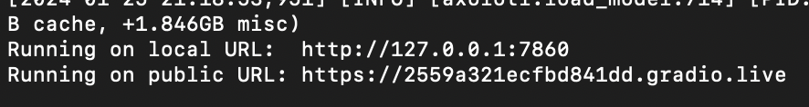

## Prerequisites
1. Create HuggingFace account
    - Accept T/C for [Aurora](https://huggingface.co/aurora-m/aurora-m-v0.1)
    - Accept T/C for [The Stack](https://huggingface.co/datasets/bigcode/the-stack-dedup) (if you want to download the example data)

2. Create [Weights and Biases](https://wandb.ai/) account

3. Add sshkey to runpod account/org (you need an administrator to do this)
    - Generate key with `ssh-keygen -t ed25519 -C "your_email@example.com"` and then look at `cat /Users/<you>/.ssh/id_ed25519.pub`
    - Paste this into Account -> Settings -> Public Keys

## Create and Connect to RunPod Instance
1. Spin up Axolotl Container
    -  Click [this link](https://runpod.io/gsc?template=v2ickqhz9s&ref=6i7fkpdz) and you will be taken to the runpod page where you will see “deploying with template axolotl-runpod”.
    - Select Organization from top right drop down
    - Scroll down to previous generation GPU section and click deploy on 1xA100 80GB. Later you can adjust this to be up to 8 and it will speed up training.
    - Leave all settings alone and click continue -> deploy
    - It will take a minute or two while it spins up the machine and the connect button becomes clickable

2. Connect to container over ssh
    - Click connect button and then this popup will show up. Click the TOP grey text to copy the "Basic SSH Terminal"
    -  Paste it into your terminal (on mac/linux) and run it. You will be dropped into a session with [TMUX running](https://www.redhat.com/sysadmin/introduction-tmux-linux). Tmux lets you resume the session if you get disconnected and do a bunch of other things, but also it makes things like scrolling weird so read that cheat sheet if you are unfamiliar
    - Note: If you forgot to add your public ssh key to the runpod org, you will get this error: `Permission Denied (publickey)`

## Setup Training
1. Run the following commands
```bash
cd /workspace/
git clone https://github.com/Stillerman/axolotl-mdel
cd axolotl-mdel
huggingface-cli login # you will need to give it a read/write token from hf.co/settings/tokens
wandb login # you will need to go to https://wandb.ai/authorize and paste the output into the terminal
```

2. Download/upload the data you want to train on to the RunPod machine
    - You can do this in multiple ways. If the data is on the cloud then they can use wget/curl to download it. If it is on their local computer they can use scp.
    - If you want to use example data, you can download 1000 examples from the mathematica portion of the stack with `python scripts/download-wr.py` (you must first accept T/C. See Prereqs.)
```bash
# example with scp (you need the bottom url for this)
scp -i ~/.ssh/id_ed25519 -P 40458 example.txt root@141.193.30.26:/workspace/axolotl-mdel
```
3. Make a configuration file for this experiment/iteration
    - `cp examples/aurora/lora.yml examples/aurora/mathematica-100.yml`
    - `vim examples/aurora/mathematica-100.yml`
    - Potentially edit lines with comments

## Train
1. `accelerate launch -m axolotl.cli.train examples/aurora/mathematica-100.yml`
    - This will pretokenize the dataset
    - Then it will download the weights (~5ish mins)
        - They are going to be cached in `/workspace/data/hf_home`
    - Then it will load in checkpoint shards (1ish mins)
2. Once everything is loaded, you will a "view run at" link like this. 

This will bring you to the WandB dashboard
    - From here you can monitor training loss, eval loss, memory usage, logs, and job status
    - When this finishes, you will see in the terminal and or wandb dashboard that it has completed

## Inference
1. Launch Gradio inference server with
    
    ```bash
    accelerate launch -m axolotl.cli.inference examples/aurora/mathematica-100.yml --lora_model_dir="./lora-out" --gradio
    ```
    
2. This will show a link along the lines of `gradio.live` and click it and you can inference with it

    
    
    
3. This is likely not robust enough for Chatbook, but it is robust enough to play with.

# Upload to HuggingFace

1. Optionally upload the model to the huggingface hub so its easy to use later
2. This can at some point be automated but given that they may not want to upload to hub at all, it is separate for now
```
huggingface-cli upload stillerman/aurora-mathematica ./lora-out/ . --token=<READ/WRITE TOKEN HERE>
```